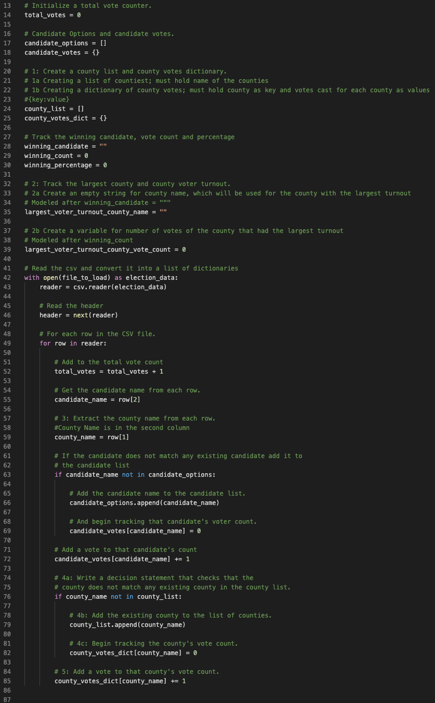

# Election_Analysis
## Project Overview
A Colorado Board of Elections employee has afforded us with the opportunity to complete the following tasks to assist with the election audit of a recent local congressional election. This election audit, and election audits in general, are important because they allow us to fact check one of the key pieces of a democracy, voting in elections. The purpose of this audit is to synthesize the data we were given concerning a recent election into an easily consumable txt file containing a brief report on our findings from the tasks assigned to us.

The election audit consists of the tasks below:

1. Calculate the total number of votes cast.
2. Get a complete list of candidates who received votes.
3. Calculate the total number of votes each candidate received.
4. Calculate the percentage of votes each candidate won.
5. Determine the winner of the election based on popular vote.

## Resources
- Data Source: election_results.csv
- Python file for review: (https://github.com/TuckerRasbury/Election_Analysis/blob/main/PyPoll_Challenge.py)
- Software: Python 3.6.1, Visual Studio Code, 1.38.1

## Election-Audit Results
The analysis of the election shows that:
- There were 369,711 votes cast in the election.
- The largest county turnout was: Denver*
- The candidates were:
  - (1) Charles Casper Stockham
  - (2) Diana DeGette
  - (3) Raymon Anthony Doane
- The candidate results were:
  - Candidate 1 received "23%" of the vote and 85,213 number of votes.
  - Candidate 2 received "73.8%" of the vote and 272,892 number of votes.
  - Candidate 3 received "3.1%" of the vote and 11,606 number of votes.
- The winner of the election was:
  - Candidate (2) Diana Degette who received "73.8%" of the vote and 272,892 number of votes.
  
 *_My code will report that the largest county turnout was Arapahoe. This is an error identified by eye, that we were unable to correct prior to submission._
  
## Election-Audit Summary
With great deference, I would like to offer a proposal to the election commission on how our work with this election can be used-with some modifications-for any election. The easiest uplift I am proposing would be a modification, an increase, in the available data. The second uplift, hinging on the first to some degree, would be the addition of a loop to be able to obtain similar election results at the state and county level. I will explore these options briefly now.

### An Increase in Data
The available data is limited to three counties. The tool we built has the capacity to analyze a much longer list of counties. In theory, the most crucial for loop in this project could compile an infinitely longer list of counties than was compiled in this project, limited only by the size of the available memory. For those with an affinity for seeing the code in question for themselves, please see the below.

#### _For Loop that Compiles List of Counties_

For those preferring a summation of the code in question, the possibilities here are endless. If more counties were added, the county_list = [] variable we created on line 24, candidate_options = [] variable created on line 17, and the for loop beginning on line 49 could create a similar audit for each.  A limitation here would be that there would not be any separation between different elections. This method would still compare all of the counties and candidates as if they were apart of the same election. This is where we get into our second proposal for an additional loop.

### Another Loop
The loop that compiles a list of counties could be built upon if we had a variable denoting which state the election was in and another denoting which candidates were in the same election. With those two theoretical values, we could create a for loop to begin going through the data by the state and then begin the for loop for the counties. After that the loop would ideally begin on the next state until all voting states were done.
